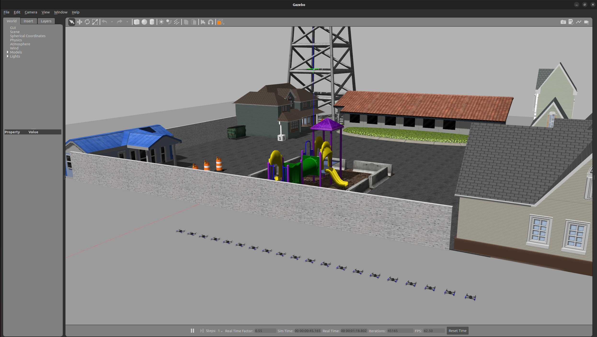

  
 [](https://codecov.io/gh/Apoorv-1009/PX4-Swarm-City-Mapper) 

# PX4 Swarm City Mapper
This project involves deploying multiple PX4 drones equipped with stereo cameras in a simulated city environment in Gazebo. The drones collaboratively map the city, generating a point cloud representation of the environment. The resulting point cloud is saved and can be visualized in RViz, providing a comprehensive 3D map of the simulated city.

# Phase 0
Phase 0 encompasses the project proposal, detailing the objectives and outlining the methodology to be employed for the software development process throughout the project. </br>
Product Dev Notes: [Link](https://docs.google.com/document/d/1IhdOAMICzZZBzhB9_Nkyce7AI6Z4n4CMd4ubZWPyqKw/edit?usp=sharing)

# Phase 1
As a part of phase 1 of this project, we successfully launched **20 Iris quadcopters** in a custom city world in Gazebo. Each drone operates independently, and we are able to retrieve critical telemetry data through ROS 2 topics, including local position, IMU readings, and velocity. These topics enable real-time monitoring and control of the swarm, providing the foundations for advanced functionalities like collaborative mapping, trajectory planning, and obstacle avoidance in the next phase of the project. </br>


All documents pertaining to this phase can be found under `UML/initial` <br>
Product Dev Notes: [Link](https://docs.google.com/document/d/1IhdOAMICzZZBzhB9_Nkyce7AI6Z4n4CMd4ubZWPyqKw/edit?usp=sharing) <br>
Product Tracking Sheet: [Link](https://docs.google.com/spreadsheets/d/1d-81s3KT0pe81IKDCRShrfuD6AH13XsJ9yQLLJY3_XI/edit?usp=sharing)

# Setting up the Workspace

## Dependencies
Following are the major dependencies for this project, the PX4 setup tools would install any minor dependencies
```bash
ROS2 Humble
Gazebo-Classic
```

Install the following packages:
```bash
sudo apt install gnome-terminal
sudo apt install dbus-x11
sudo apt install ros-humble-gazebo-ros-pkgs ros-humble-gazebo-plugins

# HIGHLY RECOMMENDED: Add this to your ~/.zshrc or ~/.bashrc
# For ~/.zshrc:
echo "export GAZEBO_PLUGIN_PATH=$GAZEBO_PLUGIN_PATH:/opt/ros/humble/lib" >> ~/.zshrc
source ~/.zshrc
# For ~/.bashrc:
echo "export GAZEBO_PLUGIN_PATH=$GAZEBO_PLUGIN_PATH:/opt/ros/humble/lib" >> ~/.bashrc
source ~/.bashrc

```

## Setting up PX4 Swarm City Mapper
This repository contains the custom world files for the city simulation, along with the launch files for spawning the world with `n` drones (max 255).

```bash
# Clone this repository
git clone https://github.com/Apoorv-1009/PX4-Swarm-City-Mapper.git
```

## Setting up PX4-Autopilot
The PX4 Autopilot is an open-source flight control software for drones and other autonomous vehicles, providing robust navigation, control, and communication capabilities. </br>
This must be built in the root folder, the following commands can be followed:

```bash
# Switch to /
cd ~/

# Clone the PX4 repository
git clone https://github.com/PX4/PX4-Autopilot.git --recursive

# Build the PX4 workspace and install the required dependencies
bash ./PX4-Autopilot/Tools/setup/ubuntu.sh

# External dependencies
pip install --user -U empy==3.3.4 pyros-genmsg setuptools

# Change to the PX4-Autopilot directory
cd PX4-Autopilot/

# Build the SITL software
make px4_sitl
```
## Setting up the ROS-GZ bridge
For getting camera topics, such as pointcloud, we need to setup a bridge between `Gazebo-Classic` and `ROS2`:
```bash
# Create a workspace for building the ROS-GZ bridge
mkdir -p ~/ros2_gz_ws/src

# Switch to this directory
cd ~/ros2_gz_ws/src

# Clone the ROS-GZ bridge repo
git clone https://github.com/gazebosim/ros_gz.git

# Switch to the cloned repo
cd ros_gz/

# Checkout to the Humble branch for ROS2 humble
git checkout humble

# Switch back to the root of this workspace
cd ~/ros2_gz_ws

# Build the workspace
colcon build 

# Source the workspace
source /install/setup.zsh

# HIGHLY RECOMMENDED: Add this to your ~/.zshrc or ~/.bashrc
# For ~/.zshrc:
echo "source /ros2_gz_ws/install/setup.zsh" >> ~/.zshrc
source ~/.zshrc
# For ~/.bashrc:
echo "source /ros2_gz_ws/install/setup.bash" >> ~/.bashrc
source ~/.bashrc
```

## Setting up Micro XRCE-DDS Agent & Client
For ROS 2 to communicate with PX4, uXRCE-DDS client must be running on PX4, connected to a micro XRCE-DDS agent running on the companion computer.

```bash
# Switch to /
cd ~/

# Clone the uXRCE package
git clone https://github.com/eProsima/Micro-XRCE-DDS-Agent.git

# Change to the Micro-XRCE-DDS-Agent directory
cd Micro-XRCE-DDS-Agent

# Make and switch to the build directory
mkdir build &&cd build

# Build the Micro-XRCE-DDS-Agent
cmake ..
make
sudo make install
sudo ldconfig /usr/local/lib/
```

Always keep the `uXRCE` agent running when doing simulations, else the drone topics would not be published. </br>
In a separate terminal:
```bash
# Switch to the Micro-XRCE-DDS-Agent directory
cd Micro-XRCE-DDS-Agent 

# Start the Micro-XRCE-DDS-Agent service
MicroXRCEAgent udp4 -p 8888
```

## Setting up PX4 msgs
The `PX4 msgs` folder is needed to define custom message types for communication between PX4 and ROS, enabling seamless integration and data exchange.

```bash
# Change directory to this workspace
cd ~/PX4-Swarm-City-Mapper/src/

# Clone the PX4 msgs package
git clone https://github.com/PX4/px4_msgs.git

# Switch to the root of this workspace
cd ~/PX4-Swarm-City-Mapper/

# Build the px4_msgs package
colcon build --packages-select px4_msgs

# Source the workspace
source install/local_setup.zsh # For zsh users
source install/local_setup.bash # For bash users

# HIGHLY RECOMMENDED: Add this to your ~/.zshrc or ~/.bashrc
# For ~/.zshrc:
echo "source /PX4-Swarm-City-Mapper/install/local_setup.zsh" >> ~/.zshrc
source ~/.zshrc
# For ~/.bashrc:
echo "source /PX4-Swarm-City-Mapper/install/local_setup.bash" >> ~/.bashrc
source ~/.bashrc
```

## Setting up the Simulation environment
To spawn our custom world, copy the `postoffice.world` file into the `PX4-Autopilot` worlds directory
```bash
# Copy the world to the PX4-Autopilot worlds/ directory
cp ~/PX4-Swarm-City-Mapper/src/px4_swarm_contoller/worlds/postoffice.world ~/PX4-Autopilot/Tools/simulation/gazebo-classic/sitl_gazebo-classic/worlds/

# Finally, build the whole workspace
cd ~/PX4-Swarm-City-Mapper/
colcon build
```

# Running the Simulation
To launch the city simulation in Gazebo with 5 drones (default):
```bash
ros2 launch px4_swarm_controller multi_drone_controller.launch.py
```
To launch `n` drones (max 255):
```bash
ros2 launch px4_swarm_controller multi_drone_controller.launch.py nb_vehicles:=n
```

If the simulation environment gives issues while spawning, try killing the gzserver and gzclient
```bash
killall gzserver gzclient
```
Testing: